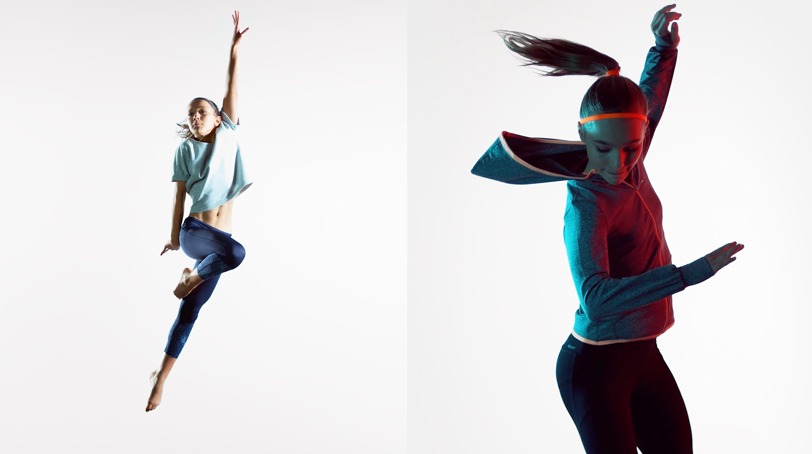
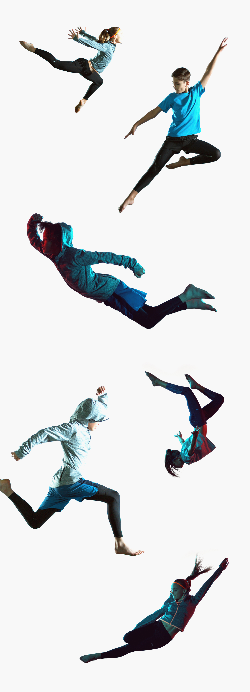
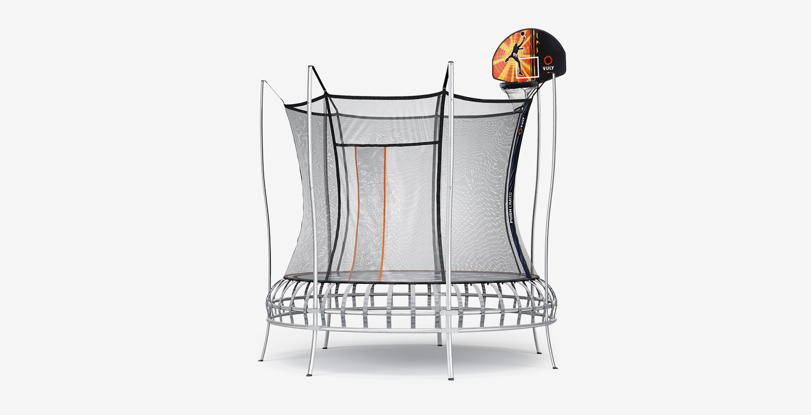
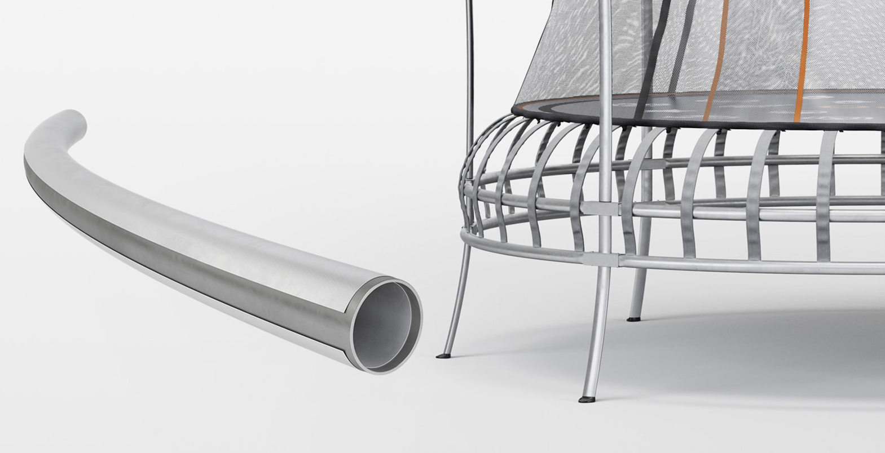
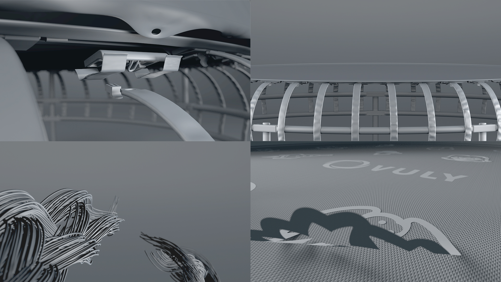
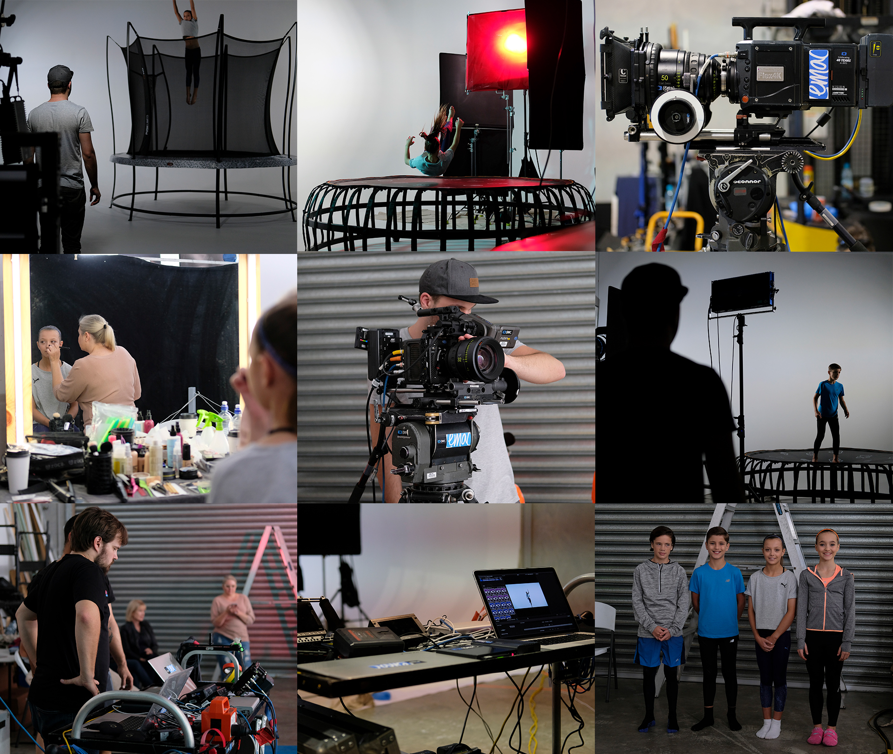

<iframe src="https://player.vimeo.com/video/249741089?title=0&byline=0&portrait=0" 
  width="640" 
  height="360" 
  frameborder="0" 
  webkitallowfullscreen 
  mozallowfullscreen 
  allowfullscreen></iframe>

# Vuly is the leader of high end trampolines in Australia. Marketing for children's products commonly have the same look and feel - hyped up energy and making use of every colour in existence. Our task was to create product videos like nothing seen in this sector before. Selecting a trampoline is just as important to adults as it is children. At the end of the day this "toy" is going to be a feature of their home - safety and fun have to meet design.

# Super high speed video capture, clean yet bold art direction, and animation to achieve detail otherwise impossible. These are the three elements that from conception were crucial to making the end product we wanted.

