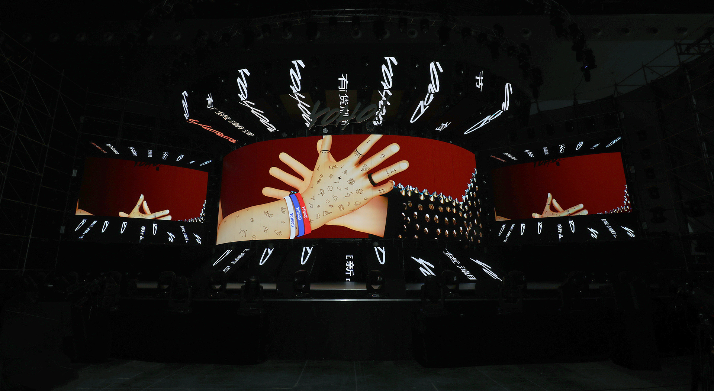
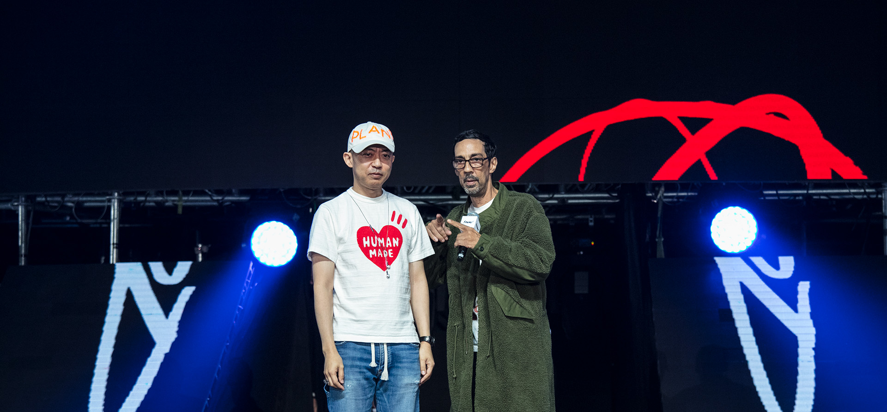
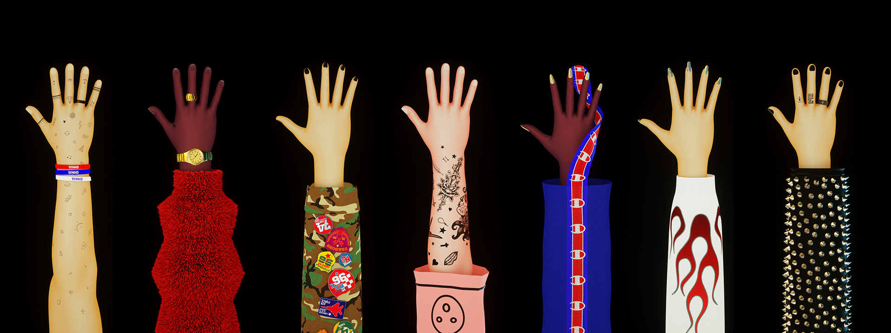
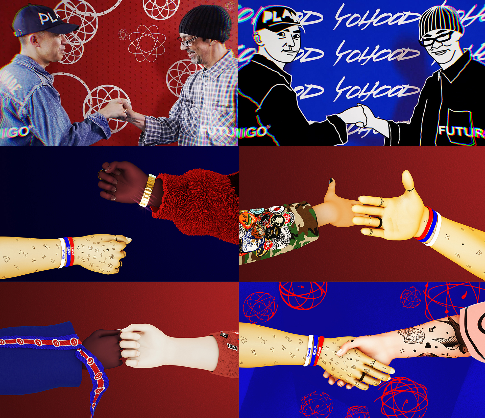
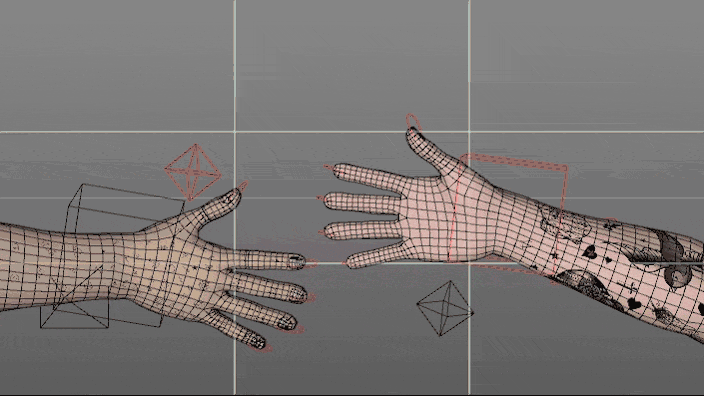
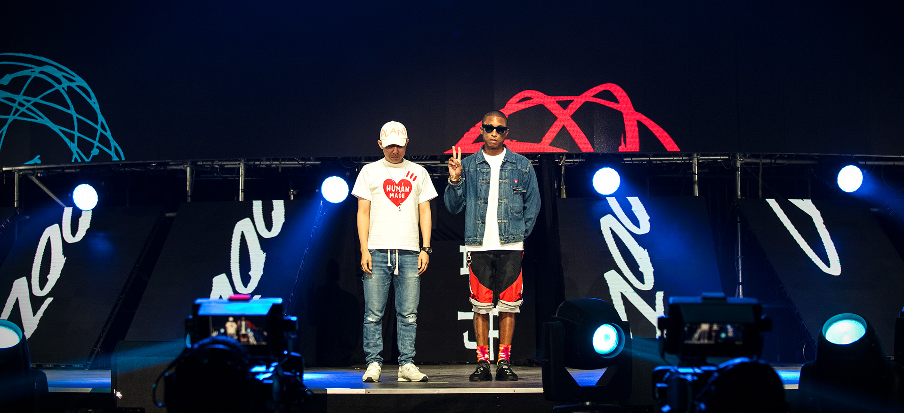

# YOHO X FUTURA

## GUMLAB collaborated with Futura to create this piece of work to capture the diversity of street fashion. With the concept of “friendship”, this video established the idea that YO’HOOD is a platform where the cool youngsters meets. [http://www.yohood.cn](http://www.yohood.cn)

<iframe src="https://player.vimeo.com/video/248272167?title=0&byline=0&portrait=0"
  width="1440"
  height="810"
  frameborder="0"
  webkitallowfullscreen
  mozallowfullscreen
  allowfullscreen></iframe>

**Full Credits:**

- Client: Yoho!
- Agency: Studio Gumwap
- Production: GUMLAB
- Creative Director: Anxing
- Animation/VFX Supervisor: Wen Shi
- Producer: Yif
- 2d Animation: Liu Xing
- 3d Animation: Lindsay Horner
